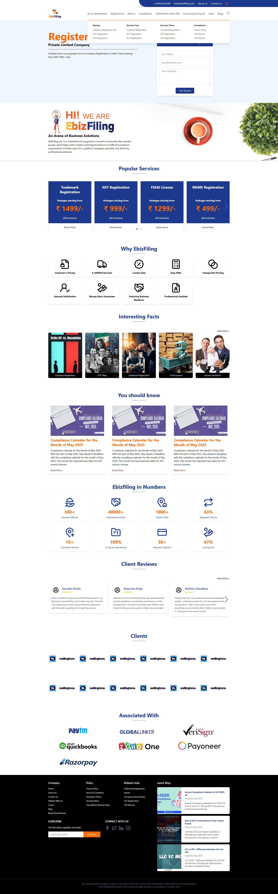

# ebiz - Responsive React Website 

## 🚀 Core Technologies

- React 19 – Powerful and efficient UI rendering

- React Router DOM (v7) – Seamless page navigation

- Tailwind CSS 4 – Modern utility-first styling framework

- Lucide Icons – Lightweight, consistent icon library

- Swiper – Beautiful, mobile-friendly carousels and sliders

- React Helmet Async – SEO enhancements with dynamic meta tags

## 🧰 Developer Tools & Build System

- Vite 6 – Lightning-fast development and build tool

- ESLint (v9) – Code linting with hooks and refresh plugins

- TypeScript Support – With @types/react and @types/react-dom

- Tailwind + Vite Plugin – Rapid styling with build-time optimization
